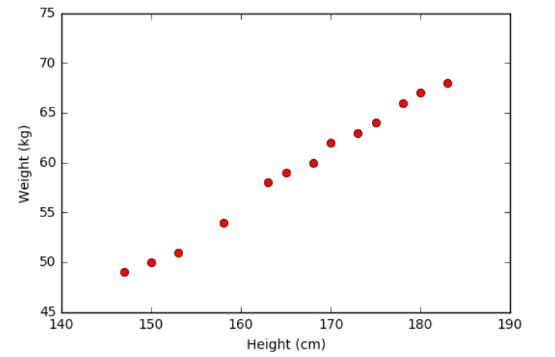
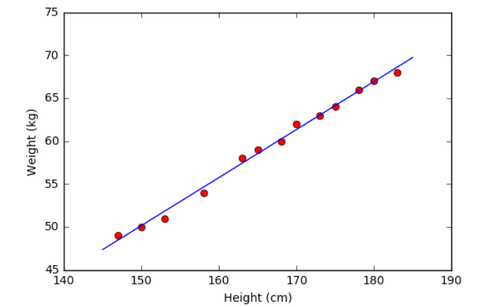
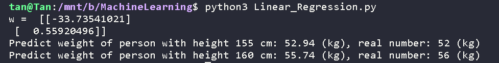
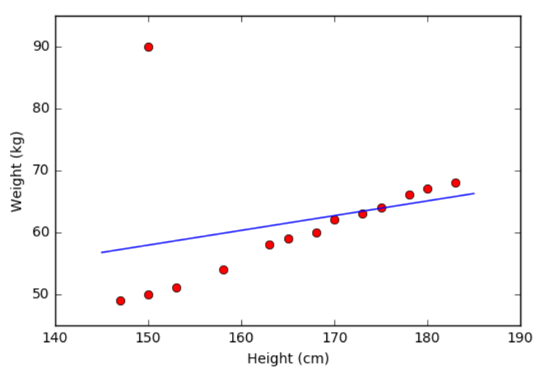

# Linear Regression - Algorithm of MachineLearning
## 1. Results and Impact of noise
Data input :
<table>
  <thead>
    <tr>
      <th style="text-align: center">Chiều cao (cm)</th>
      <th style="text-align: center">Cân nặng (kg)</th>
      <th style="text-align: center">Chiều cao (cm)</th>
      <th style="text-align: center">Cân nặng (kg)</th>
    </tr>
  </thead>
  <tbody>
    <tr>
      <td style="text-align: center">147</td>
      <td style="text-align: center">49</td>
      <td style="text-align: center">168</td>
      <td style="text-align: center">60</td>
    </tr>
    <tr>
      <td style="text-align: center">150</td>
      <td style="text-align: center">50</td>
      <td style="text-align: center">170</td>
      <td style="text-align: center">72</td>
    </tr>
    <tr>
      <td style="text-align: center">153</td>
      <td style="text-align: center">51</td>
      <td style="text-align: center">173</td>
      <td style="text-align: center">63</td>
    </tr>
    <tr>
      <td style="text-align: center">155</td>
      <td style="text-align: center">52</td>
      <td style="text-align: center">175</td>
      <td style="text-align: center">64</td>
    </tr>
    <tr>
      <td style="text-align: center">158</td>
      <td style="text-align: center">54</td>
      <td style="text-align: center">178</td>
      <td style="text-align: center">66</td>
    </tr>
    <tr>
      <td style="text-align: center">160</td>
      <td style="text-align: center">56</td>
      <td style="text-align: center">180</td>
      <td style="text-align: center">67</td>
    </tr>
    <tr>
      <td style="text-align: center">163</td>
      <td style="text-align: center">58</td>
      <td style="text-align: center">183</td>
      <td style="text-align: center">68</td>
    </tr>
    <tr>
      <td style="text-align: center">165</td>
      <td style="text-align: center">59</td>
      <td style="text-align: center">&nbsp;</td>
      <td style="text-align: center">&nbsp;</td>
    </tr>
  </tbody>
</table>

Visualation Data Input:

     

Visualation OutPut:

     

Results and Prection:

     

When Noise Data:
<table>
  <thead>
    <tr>
      <th style="text-align: center">Chiều cao (cm)</th>
      <th style="text-align: center">Cân nặng (kg)</th>
      <th style="text-align: center">Chiều cao (cm)</th>
      <th style="text-align: center">Cân nặng (kg)</th>
    </tr>
  </thead>
  <tbody>
    <tr>
      <td style="text-align: center">147</td>
      <td style="text-align: center">49</td>
      <td style="text-align: center">168</td>
      <td style="text-align: center">60</td>
    </tr>
    <tr>
      <td style="text-align: center">150</td>
      <td style="text-align: center">90</td>
      <td style="text-align: center">170</td>
      <td style="text-align: center">72</td>
    </tr>
    <tr>
      <td style="text-align: center">153</td>
      <td style="text-align: center">51</td>
      <td style="text-align: center">173</td>
      <td style="text-align: center">63</td>
    </tr>
    <tr>
      <td style="text-align: center">155</td>
      <td style="text-align: center">52</td>
      <td style="text-align: center">175</td>
      <td style="text-align: center">64</td>
    </tr>
    <tr>
      <td style="text-align: center">158</td>
      <td style="text-align: center">54</td>
      <td style="text-align: center">178</td>
      <td style="text-align: center">66</td>
    </tr>
    <tr>
      <td style="text-align: center">160</td>
      <td style="text-align: center">56</td>
      <td style="text-align: center">180</td>
      <td style="text-align: center">67</td>
    </tr>
    <tr>
      <td style="text-align: center">163</td>
      <td style="text-align: center">58</td>
      <td style="text-align: center">183</td>
      <td style="text-align: center">68</td>
    </tr>
    <tr>
      <td style="text-align: center">165</td>
      <td style="text-align: center">59</td>
      <td style="text-align: center">&nbsp;</td>
      <td style="text-align: center">&nbsp;</td>
    </tr>
  </tbody>
</table>

Visualation With Noise:

     

