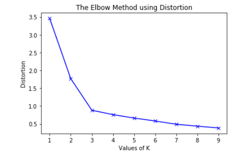

# K Mean Clustering
## Algorithm:
### Step1: Choose Any K point do the Initial center
### Step2: Assign each data point to the cluster with the nearest center to it.
### Step3: If the assignment of data to each cluster in step 2 does not change compared to the previous loop, we stop the algorithm.
### Step4: Update the center for each cluster by taking the average of all the data points assigned to that cluster after step 2.
### Step5: Go back to step 2.
## Defect:
Can't not cluster for data set complex

     

 

     

 
## How to find the suitable K ??
 
### You can using  Elbow method

     

Choose K = 3 
