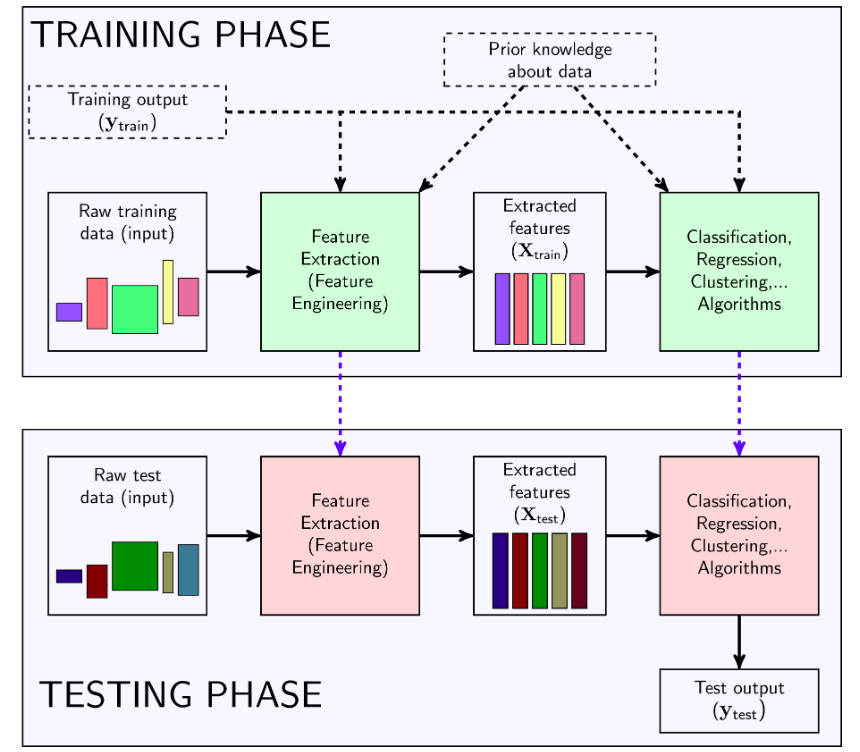

# Feature Enginerring
## 1. General model for Machine Learning problems
- Most Machine Learing probelems can be shown in the following figmure :

  

- There are two major phases: The Training phase and the Testing phase. Again, for Supervised learning problems, we have pairs of data(input and output), for Unsupervised learning problems, we 
only have input.

### a. Training Phase:
Có hai khối có nền màu xanh lục chúng ta cần phải thiết kees:
#### Feature Extractor 
- Đầu ra:
Với mục đích của Feature Engineering là tạo ra một Feature Extractor biến dữ liệu ban đầu phù hợp với từng mục đích khác nhau.
- Đầu vào :
Raw training input: Là tất car các thông tin ta biết về dữ liệu. Ví dụ như pixel, từ, câu,âm thanh,... Các dữ liệu này thường không ở dạng vector, không có sô chiều như nhau. thâm chí có thể có số chiều như nhau nhưng số chiều quá lớn.
(Optional) Output của training set. Trong các bài toán Unsupervised learning, ta không biết output nên hiển nhiên sẽ không có đầu vào này. Còn tronng bài toán Supervised learning, có khi dữ liệu này cũng không được sử dụng.
(Optinal) Prior knoledge about data: Đôi khi những giả thiết khác về dữ liệu cũng mang lại lợi ích.
#### Main Algorithms
Trong một số thuật toán cao cấp hơn, việc huấn luyện feature extractor và main algorithm được thực hiện cùng úc với nhau chứ không phải từng bước.
#### Lưu ý :
- Trong quá trình xây dựng thì không đươc sử dụng bất cứ thông tin nào trong tập test data. ta phải giải sử rằng những thông tin trong test data chưa được nhìn thấy bao giờ. Nếu sử dụng thêm thông tin về test data thì rõ ràng ta đã ăn gian.

### b. Testing phase
Bước này đơn giản hơn nhiều. Với raw input mới, ta sử dugnj feature extractor đã tạo được ở trên (Không được sử dụng output vì output là cái ta đang tìm) để tạo ra feature vector tương ứng. feature vector được đưa vào main algorithm đã được học ở training phase để dự đoán output

## 2. Feature Engineering examples
### Dimensionality reduction
- Phương pháp này giúp làm giảm số chiều của dữ liệu để giảm bộ nhớ và khối lượng tính toán. Việc giảm số chiều này có thể được thực hiện bằng nhiều cách, trong đó random projection là cách đơn giản nhất. Tức chọn một ma trận  chiếu (project matrix) ngẫu nhiên( ma trận béo) rồi nhân nó với từng điểm dư liệu (giả sử dữ liệu ở dạng vector cột) để được các vector có số chiều thấp hơn. Ví dụ, vector ban đầu có số chiều là 784, chọn ma trận chiếu có kích thước (100x784), khi đó nếu nhân ma trận chéo này với vector ban đầu, ta sẽ được một vector mới có số chiều là 100, nhỏ hơn số chiều ban đầu rất nhiều. Lúc này, có thể ta không có tên gọi cho mỗi feature nữa vì các feature ở vector ban đầu đã được trộn lẫn với nhau theo một tỉ lệ nào đó rồi lưu và vector mới này. Mỗi thành phần của vector mới này được coi là một feature (không tên).
- Việc chọn một ma trận chiếu ngẫu nhiên đôi khi mang lại kết quả tệ không mong muốn vì thông tin bị mất đi quá nhiều. Một phương pháp được sử dụng nhiều để hạn chế lượng thông tin mất đi có tên là **Principle Component Analysis**
### Bag-of-words (BoW) for Computer Vision
Dùng để lọc từ, ứng dụng cho ML ngôn ngữ.

### Feature Scaling and Normalizaion
Các điểm dữ liệu đôi khi được đo đạc với những đơn vị khác nhau, m và feet chẳng hạn. Hoặc có hai thành phần (của vector dữ liệu) chênh lệch nhau quá lớn, một thành phần có khoảng giá trị từ 0 đến 1000, thành phần kia chỉ có khoảng giá trị từ 0 đến 1 chẳng hạn. Lúc này, chúng ta cần chuẩn hóa dữ liệu trước khi thực hiện các bước tiếp theo.
**Chú ý:** việc chuẩn hóa này chỉ được thực hiện khi vector dữ liệu đã có cùng chiều.
#### 1. Rescaling
Phương pháp đơn giản nhất là đưa tất cả các thành phần về cùng một khoảng, [0,1] hoặc [−1,1] chẳng hạn, tùy thuộc vào ứng dụng. Nếu muốn đưa một thành phần (feature) về khoảng [0,1], công thức sẽ là:
            x' = (x - min(x))/(max(x)-min(x))
trong đó x là giá trị ban đầu, x' là giá trị sau khi đã chuẩn hóa, max và min được tính trên toàn bộ dữ liệu training. Việc này được thực hiện trên từng thành phần của vector dữ liệu x.
#### 2. Standardizaion
Một phương pháp sử dụng giả sử là thành phần phân phối đều có phân phối với kỳ vọng là 0 và phương sai là 1. KHi đó, công thức chuẩn hoá sẽ là :
            x' = (x - /x)/ độ lệch chuẩn
/x là kì vọng
#### 3. Scaling to unit length
Một lựa chọn nữa đưược dùng rọng rãi là chuẩn hoá các thành phần của mỗi vector dữ liệu sao cho toàn bộ vector có độ lớn (Euclid, tức norm 2) bằng 1. Việc này có thể dược thực hiện bằng
            x' = x/ ||x||_2
