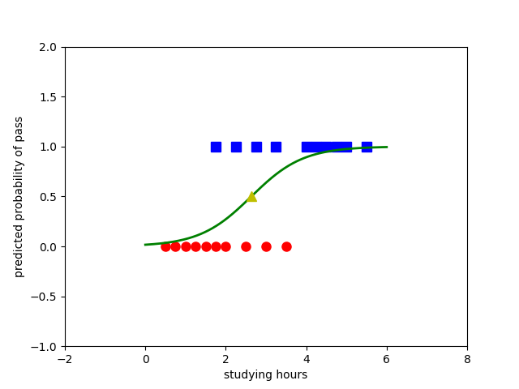
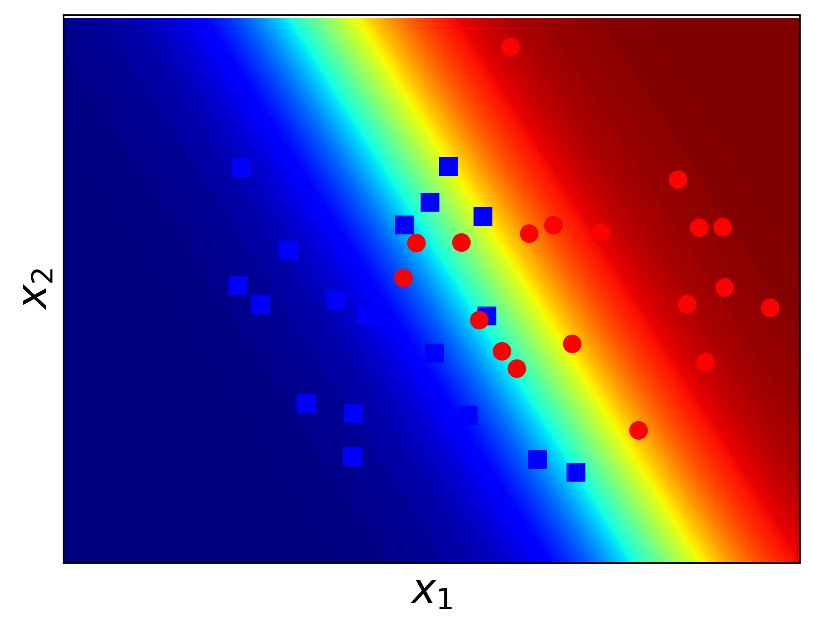

# Logistic Regression
## Recall two linear models
y = f (w.T*x)
f(x) called activation function and x is interpreted as data extended with x_0 =1
- PLA : f(s) = sgn(x) : The output takes only one of two values 1 or -1, suitable for binary classification problems.
- Linear Regress: f(s) = s: The tyeo is suitable if we need to predict a real value of output with not blocked up and down.
**New model is Logistic Regression : Used for more flexible problems.**
- This model likes linear regression in terms of real number output, and similar to PLA in bloked output (in segment [0,1])
- this model Often used for classification problems
- Activation function is f(s)=1/(1+exp(-s)) (**sigmoid function**) or f(s)=exp(s)/(exp(s)+exp(-s))

## Model Logistic Regression
- We use Stochastic Gradient Descent (SGD) method again for Jaw loss optimization
- The Updated formula (according to SGD algorithm) for logistic regression is:
        w = w + n*(y_i - z_i)*x_i ; z_i = f(s_i)

## Application for Logistic Regression
- Logistic Regression does not need the assumption tha the two-class is linearly separable.
- However, the detected boundary remains linear. So this model is only suitable gor data types where two classes are closely related to linearly separable.
- Hạn chế : Không làm việc được với dữ lieejy mà một class chuwasc các điểm nằm trong 1 vòng tròn, class kia chứa các điểm nằm bên ngoài đường tròn đó => Cần mô hình phức tạp hơn. Và các điểm dữ liệu được tạo ra một cách độc lập với nhau, nhưng trên thực tế, các điểm dữ liệu có thể bị ảnh hưởng bởi nhau.

## Result

